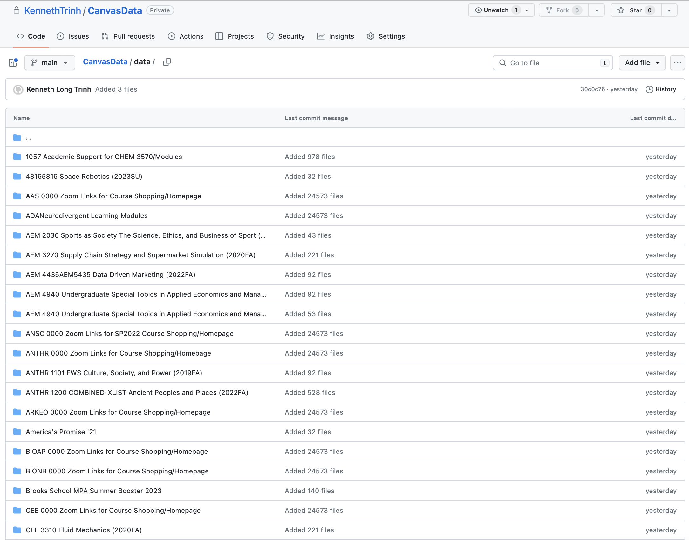

# Follow along as I scrape all my course materials accumulated over 4 years

I noticed that there was no automated way to download **everything** from *Canvas Instructure*, a web-based learning management system to store course materials.  Objectively, Canvas is an oppressive overseer of academic progress, chaining users to its labyrinthine web interface.  A malicious gatekeeper, Canvas stands as a formidable barrier, restricting access to educational content and ensnaring users in its tangled web.

Nonetheless, this lack of a `<Download-Everything-Button>` seems to be a bug on their part, and someone needs to be fired.  We don't pay 80k a year to suck our thumbs.

Luckly for us, I have no friends, and can write some cool programs.  I'm gonna scrape all the contents of my canvas to exemplify Cornell's Any Person, Any Study motto.  I'm going to download everything from every course without opening my browser.  Note, the code I've written is Cornell specific, but if you're a student at another university, it's likely you use similar technologies.  The only thing that may be diifferent is the authentication steps.  Feel free to contact me if you have an enterprise specific question!

## Background
- Instructure / Canvas LMS has a valuation of $2.9 Billion (https://iblnews.org/instructure-canvas-details-its-ipo-a-valuation-of-2-9-billion-expected/)

- Edstem Technologies's estimated annual revenue is currently $8M per year (https://growjo.com/company/Edstem_Technologies)

-  As of June 2023 Box has a market cap of $4.32 Billion (https://companiesmarketcap.com/box/marketcap/)

Let's take their websites apart!

## Setup
```
python -m venv env
source env/bin/activate
pip install -r requirements.txt
```

Then log onto canvas and go to Account >> Settings >> + New Access Token 

Careful! This token **can only be viewed once**.  Also, **don't share this with anyone**.  
Make this an environment variable called CANVAS_TOKEN

On mac:
```
export CANVAS_TOKEN=<your-token-here>
```

On windows:
```
set CANVAS_TOKEN=<your-token-here>
```


You can also just paste this into your env/bin/activate file if you want, then source it again.

## Setup for Authorization Required Scripts (Optional)
It turns out that Quizzes and Ed Posts require username/password authentication with two factor login - *quel cauchemar* ! 

Luckily, I went throught the http requests and reverse-engineered the login process so you don't have to.  Feel free to look at `misc/CanvasRequests.png` and `misc/EdRequests.png` for the chain of requests that happen (I just use chrome dev tools, no postman needed), and check my implementation in `canvasDuoEdLogin.py` for each one.  Follow the steps below to get your username and password set up - 

On mac:
```
export USERNAME=<your-username-here>
export PASSWORD=<your-password-here>
```
On windows:
```
set USERNAME=<your-username-here>
set PASSWORD=<your-password-here>
```

Test that you can run `canvasDuoLogin.py` - before running script, make sure you have duo mobile installed and ready to go. Then run the script:
```
python canvasDuoEdLogin.py
```

You'll be prompted with this message:
```
Evaluate Push
```
Go to your phone and accept the push notification. Successful authentication will result in this message:
```
Login Successful https://canvas.cornell.edu/?login_success=1
```

**Disclaimer: This happens fast!** 
After running `canvasDuoEdLogin.py`, you have about 5 seconds on your phone to two-factor authenticate, so have the app ready.  

Since `scrapeEdPosts.py` and `scrapeExistingQuizzes.py` import from `canvasDuoEdLogin.py`, you also have about 5 seconds to authenticate after running those scripts too.


# Scripts

## `scrapeCanvas.py` 

This one just requires your API key - we read this as an environment variable in `consts.py`, so make sure you set it up (described in setup section).  

The Canvas API is well documented, but poorly designed.  If you're interested, here it is:
https://canvas.instructure.com/doc/api/

Fortunately for us, some alpha chad programmers
made an API wrapper: https://canvasapi.readthedocs.io/en/stable/
I use this extensively for most helper functions in this script, but I also use the requests library for some unsupported endpoints.

At a high level, this is what we do:
1. Get all courses
2. For each course:
    - Download Everything in `Modules`
    - Download Everything in `Assignments`
    - Download Everything in `Files`
    - Download the `Syllabus`
    - Download the `Discussions`
    - Download the `Pages`
    - Download the Course `Homepage`

Each course is different - Modules, Assignments may be enabled or disabled.  We use python decorators to catch the specific error if say, the `Modules` don't exist.  Moreover, I found most courses don't enable the `Files` (this is once again a tyranical attempt by the educational monstrosity of canvas to gatekeep information).  In fact, when you try to access the `Files` endpoint for most courses, you get a `403 Forbidden` status code, which means the Canvas understands the request but refuses to authorize it.  This is fine, because I designed the code to thoroughly scape all the files anyway (you just need to access them through `Modules`, `Assignments`, `Syllabus`, `Discussions`, `Pages`, and `Homepage`).


## `scrapeEdPosts.py`  (Auth. Required)

This was actually me just messing with the Edstem API.  I didn't even read their docs, but I wanted to scrape all the Ed Posts that I have access to.  For this script, you have to do the 5 second authentication thing here for the following reasons:

- We must access the Ed course through Canvas, as there is no other way to iterate over all the avaliable Ed courses - this is because a link to an Ed course will originate in the form: 
``` 
https://canvas.cornell.edu/courses/[course-id]/external_tools/[other-crap-here]
```

- We need two factor authentication to access the homepage of a course - to access a **non-api** canvas course: 
```
https://canvas.cornell.edu/courses/[course-id]
```

- For some reason, accessing the `external_tools` endpoint through the Canvas API is broken.  Just another bug by Canvas, the unforgiving diabolical puppet master.


So after getting the canvas link to external tools, it will redirect to Ed.  Ed will check our cookie, then through a complicated process (see `def EdCourseAuthenticationThroughCanvas`for more details), we can get our `x-token` which tells Ed that we're authoirzed to access the course forum.  Ed is client side rendered, which means some javascript code (stored on a CDN - content delivery network) takes the data from the Ed API and renders it on our browser. 

## `scrapeExistingQuizzes.py` (Auth. Required)

This one also requires the the 5 second authentication thing.  The reason is similar:
- Can't access quizzes and quiz questions through the API **as a student**, only through the regular url:
```
https://canvas.cornell.edu/courses/[course-id]/quizzes/[quiz-id]
```

- For clarity, the API url (what the `canvasapi` wrapper uses under the hood) is:
```
https://canvas.cornell.edu/api/v1/courses/[course-id]/quizzes/[quiz-id]
```

And this throws a `403 Forbidden` error for us as students.  So we have to go through the regular url.


Lastly, we can only access quizzes we've taken, so here I only iterate through my personal courses.

## `scrapeBoxLinks.py`

This is very optional, and likely not very applicable to your case.  I just noticed a few courses had box links that only Cornell students could access.  I guess Cornell bought box enterprise software.  But remember, Any Person, Any Study.  So I wrote this script to download all the files from the box links, even if they're preview only. Suprisingly, this one only requires username and password (no two-factor).  We can tell because of the `e1s1` in the Cornell idp url:
```
https://shibidp.cit.cornell.edu/idp/profile/SAML2/POST/SSO?execution=e1s1
```

Then, our `requestToken` will be in a `Box.config` variable which is stored in a \<script> \</script> tag of the html response of a GET request to the redirect url:
```
https://cornell.box.com/s/(.*) ---redirect---> https://cornell.app.box.com/s/(.*)
```

Then, we can use the `requestToken` to get the read `access_token`, which I named `readToken`.  This will give us permission to make one final GET request our resource, which we can stream in the bytes to write it into a file (it was a pdf and mp4 in my case), even if the download button is disabled!  This one was much more complicated, feel free to look at code.


## Running as nohup process

I'm running `scrapeCanvas.py` on Cornell's linux (lol) since it takes a **LONG** time.  Also, I'm poor, and my device doesn't have a lot of space.  Here's the command
```
nohup python -u scrapeCanvas.py > output.log &
```

# Results

Here are some stats from my scraping:
```
Total files: 27254
Total size: 34.188166765 GB
```

I put everything on a private repo for now, just waiting on my degree in the mail.  Considering making it public, but don't want to get sued for now.  I even had to write an `upload.py` script since github has a max of 100MB peer upload.  Here's a screenshot of the repo:



Here's a complete list (feel free to contact me if you want to self study any of these courses):

```
klt45@en-ci-cisugcl19:~/CanvasData/data$ ls
1057 Academic Support for CHEM 3570
48165816 Space Robotics (2023SU)
AAS 0000 Zoom Links for Course Shopping
ADANeurodivergent Learning Modules
AEM 2030 Sports as Society The Science, Ethics, and Business of Sport (2023SP)
AEM 3270 Supply Chain Strategy and Supermarket Simulation (2020FA)
AEM 4435AEM5435 Data Driven Marketing (2022FA)
AEM 4940 Undergraduate Special Topics in Applied Economics and Management (2020SP)
AEM 4940 Undergraduate Special Topics in Applied Economics and Management (2021SP)
ANSC 0000 Zoom Links for SP2022 Course Shopping
ANTHR 0000 Zoom Links for Course Shopping
ANTHR 1101 FWS Culture, Society, and Power (2019FA)
ANTHR 1200 COMBINED-XLIST Ancient Peoples and Places (2022FA)
ARKEO 0000 Zoom Links for Course Shopping
America's Promise '21
BIOAP 0000 Zoom Links for Course Shopping
BIONB 0000 Zoom Links for Course Shopping
Brooks School MPA Summer Booster 2023
CEE 0000 Zoom Links for Course Shopping
CEE 3310 Fluid Mechanics (2020FA)
CEE 43706370MAE 6270
CEE 4520 Sustainable Safe Water on Tap (2019FA)
CEE 4590 Water Treatment Capstone (2020SP)
CEE 6055 Noise in Biology & Environmental Sciences
CEE 6370 COMBINED Experimental Methods in Fluid Dynamics (2021FA)
CHEM 1007 Academic Support for CHEM 2070 (2020FA)
CHEME 0000 Zoom Links for Course Shopping
CHIN 1101 Beginning Mandarin I (2020FA)
CHIN 1102 Beginning Mandarin II (2021SP)
CIPA 0000 Zoom Links for Course Shopping
CLASS 0000 Zoom Links for Course Shopping
CLK Sandbox
COML 3550 COMBINED-XLIST Decadence (2020SP)
COMM 3150 Organizational Communication Theory and Practice (2020FA)
COMM 4300 Ethics in New Media, Tech and Comm 2023 summer)
COMS 0000 Zoom Links for Course Shopping
COVID-19 Educational Training for All Students
CS 1110 Introduction to Computing Using Python (2021SP)
CS 1110 Introduction to Computing Using Python (2022SP)
CS 2043 UNIX Tools and Scripting (2023SP)
CS 2110. OO Prog & Data Structs, Sp 2022
CS 4700 COMBINED-COMEET Foundations of Artificial Intelligence (2022FA)
CS 4740 COMBINED Natural Language Processing (2022FA)
CS 47805780 Introduction to Machine Learning (2021SP)
CS 6740 COMBINED-XLIST Advanced Language Technologies (2023SP) Cornell Tech (New York City) sections
CS 6740 COMBINED-XLIST Advanced Language Technologies (2023SP) Ithaca sections
CS 6742INFO 6742 Natural Language Processing and Social Interaction (2021FA)
CS 6830 Cryptography (2020FA)
CS 7792 Fairness and Dynamics of Learning Systems (2021fa)
CS2110  OO Progr & Data Structs 2020 FA
CS2110 OO Programming and Data Structures (2021SP)
CSENGRD 2110 Fall 2021
CVM Video Collections
Career Development Toolkit
DSOC 2710 COMBINED America's Promise Social and Political Context of American Education (2022SP)
Disability Studies A Brief History
Dr. Phil's Gallery of Video, Animation & Simulation Materials for Teaching
EAS 0000 Zoom Links for Course Shopping
ECE 0000 Electrical and Computer Engineering Advising
ECE 2200 COMBINED-XLIST Signals and Information (2021SP)
ECE 3140 COMBINED-XLIST Embedded Systems (2022SP)
ECE 3150 Introduction to Microelectronics (2022SP)
ECE 3250 Mathematics of Signal and System Analysis (2021FA)
ECE 3400 Intelligent Physical Systems (2021FA)
ECE 4130 COMBINED-XLIST Introduction to Nuclear Science and Engineering (2020FA)
ECE 4130 COMBINED-XLIST Introduction to Nuclear Science and Engineering (2021FA)
ECE 4200 COMBINED-COMEET Fundamentals of Machine Learning (2021FA)
ECE 4960 COMBINED-COMEET Special Topics in Electrical and Computer Engineering (2023SP)
ECE 5760 Advanced Microcontroller Design (2022SP)
ECON 1110 Introductory Microeconomics (2020SP)
ECON 2040 COMBINED-XLIST Networks (2022FA)
ECON 3030 Intermed Microecon Theory Sessions,J
ECON 3030 Intermediate Microeconomic Theory (2020SU)
ECON 3030 Intermediate Microeconomic Theory (2021SU)
ECON 3030 Intermediate Microeconomic Theory (2022SU)
ECON 4260 Public Finance The Microeconomics of Government (2021FA)
ENGL 0000 Zoom Links for Course Shopping
ENGL 4910 Honors Seminar I (2019FA)
ENGRC 3500.102 Engineering Communications (2022FA)
ENGRD 2100 COMBINED-XLIST Introduction to Circuits for Electrical and Computer Engineers (2020FA)
ENGRD 2300 COMBINED-XLIST Digital Logic and Computer Organization (2020FA)
ENGRI1140 - MSE 1140 Materials The Future of Energy (2020FA)
ENMGT 3102 COMBINED Basics of Programming in Python (2023SP)
ENTOM 4040 Diversity, Equity, and Inclusion in STEM The Science Behind Bias Seminar (2022SP)
ESS Capstone Teaching Resources
English Language Support Office (ELSO) Resources
FGSS 0000 Zoom Links for Course Shopping
FREN 3730 Religious Violence in French and Francophone Literature (2020FA)
Graduate School Orientation Spring 2023
HCI Studio INFO 44206520 (2022SP)
HD 0000 Zoom Links for Course Shopping
HD 2930 COMBINED-XLIST Introduction to Data Science for Social Scientists (2023SP)
HIST 0000 Zoom Links for Course Shopping
HIST 1200 FWS Writing History (2020SP)
How to Be an Antiracist (ebook)
INFO 2300 Intermediate Design and Programming for the Web (2023SP)
INFO 4320 COMBINED-COMEET Introduction to Rapid Prototyping and Physical Computing (2022FA)
INFO 4320 COMBINED-COMEET Introduction to Rapid Prototyping and Physical Computing (2022SP)
INFO 4320 COMBINED-COMEET Introduction to Rapid Prototyping and Physical Computing (2023SP)
INFO 4320 Introduction to Rapid Prototyping and Physical Computing (2019FA)
INFO 4320 Introduction to Rapid Prototyping and Physical Computing (2020SP)
INFO 4320 Introduction to Rapid Prototyping and Physical Computing (2021SP)
INFO 4340 App Design and Prototyping (2023SP)
INFO 4420 HCI Studio Guimbretiere,F
INFO 44206520 Human Computer Interaction Studio
INFO 4420INFO6250 (Fall 2020)
INFO 6520 Human Computer Interaction Graduate Studio (2022SP)
INFO 6940 Rural Computing and Rural Infrastructure
INFO44206520 HCI Studio (2020SP)
Introduction to Rapid Prototyping and Physical Computing (2021FA)
LAW 3281 COMBINED-XLIST Constitutional Politics (2020FA)
LING 0000 Zoom Links for Course Shopping
MAE 2030 Dynamics (2021SP)
MAE 2030 Dynamics (Spring 2019)         Prof. Andy Ruina
MAE 4730 COMBINED-COMEET Intermediate Dynamics (2020FA)
MAE 47305730 Intermediate Dynamics (2021FA)
MAESYSEN 48165816 Space Robotics - Prof Timothy Sands
MAESYSEN 58306830 Astronautic Optimization - Prof Timothy Sands
MATH 0000 Zoom Links for Course Shopping
MATH 1910 Calculus for Engineers (2019FA)
MATH 1920 Multivariable Calculus for Engineers (2019FA)
MATH 1920 Multivariable Calculus for Engineers (2020FA)
MATH 1920 Multivariable Calculus for Engineers (2020SP)
MATH 2230 Theoretical Linear Algebra and Calculus (2022FA)
MATH 2240 Theoretical Linear Algebra and Calculus (2023SP)
MATH 2930 Differential Equations for Engineers (2020FA)
MATH 2940 Linear Algebra for Engineers (2021SP)
MATH 4500 Matrix Groups (2021SP)
MATH 7710 Topics in Probability Abelian Networks
MODERN SEPHARDIC AND MIZRAHI IDENTITIES
MSE 0000 Zoom Links for Course Shopping
MUSIC 3151 Beyond the Five Lines (2021SP)
MUSIC 3621 Cornell Symphony Online (2020FA)
MUSIC 3621 Cornell Symphony Orchestra (2021SP)
Maya History
Maya Inscriptions
Medieval Dreams and Visions
NBA 5925 Johnson Experiential Leadership Expedition (2023SP)
NBA 6070 Designing Data Products (2022SP)
NBA 6070, Designing Data Products, Lutz Finger, (2023SP)
NBA 6290 Special Topics in Marketing (2020FA)
NBA 6390 Data Driven Marketing, S. Gupta (2022FA)
NBA 6390, Data Driven Marketing, Sachin Gupta (2021FA)
NBAY 6080 Building Entrepreneurial Ventures (2021SU), Khaire, M
NBAY 6170 Designing Data Products (2021FA)
NBAY 6170 Designing Data Products (2022FA)
NES 0000 Zoom Links for Course Shopping
NES 3655 COMBINED Minorities of the Middle East (2023SP)
NRE 5220 Doctoral Seminar in Quantitative Models (2021FA)
NRE 5220 Quantitative Models in Marketing Empirical Methods (2019FA)
NTRES 0000 Zoom Links for Course Shopping
NTRES 6200  Spatial Modeling and Analysis (2020SP)
NUTRSCI 0000 Zoom Links for Course Shopping
OADI Employment
ORIE 0000 Zoom Links for Course Shopping SP22
ORIE 3120 Practical Tools for Operations Research, Machine Learning and Data Science (2023SP)
ORIE 4390 COMBINED-COMEET Optimization Models for Logistics, Networks, and Markets (2022FA)
On-Campus Recruiting (OCR) Tutorial
PADM 5320 COMBINED-XLIST Public Systems Modeling (2019FA)
PAM 0000 Zoom Links for Course Shopping
PAM 3301 COMBINED-COMEET Intermediate Policy Analysis (2023SP)
PHIL 0000 Zoom Links for Course Shopping
PHYS 1204 COMBINED-XLIST Physics of Musical Sound (2022SP)
PHYS 1204 COMBINED-XLIST Physics of Musical Sound (2023SP)
PHYS 2214 Physics III Oscillations, Waves, and Quantum Physics (2021SP)
PHYS 44807680 COMBINED Computational Physics (2020FA)
PHYS 6561 Classical Electrodynamics (2020FA)
PHYS 7680 COMBINED Computational Physics (2022FA)
PLSCS 6200 COMBINED-XLIST Spatial Modeling and Analysis (2023SP)
PLSCSNTRES 6200 Spatial Modeling and Analysis (2021SP)
PLSCSNTRES 6200 Spatial Modeling and Analysis (2022SP)
PLSCSNTRES 6200 Spatial Modeling and Analysis Rossiter,D
RUSSA 1121 Elementary Russian through Film (2022FA)
RUSSA 1122 SEM 102 (2023SP)
RUSSA 1132 SEM 101 2 credits (2023SP)
RUSSA 1132 SEM 102 4 credits (2023SP)
RUSSA 2203 Intermediate Composition and Conversation (2022FA)
SHUM 0000 Zoom Links for Course Shopping
SYSEN 5420  ECE 6970 Network Systems and Games
SYSENMAE 52806280 Adaptive and Learning Systems - Prof Timothy Sands
Special Species Symposium 2023
Time and History in Ancient Mexico (Fall 2021)
VTPEH 6108 Applied Data Analysis (2022FA)
VTPMD 6108 Applied Data Analysis (2021FA)
WRIT 7100 Sandbox
```

I also took these, which are archived on Canvas for some reason:
```
CS 4820 COMBINED-XLIST Introduction to Analysis of Algorithms (2022FA)
CS 4410 Operating Systems (2021FA)
ECE 3100 COMBINED-XLIST Introduction to Probability and Inference for Random Signals and Systems (2022SP)
ECE 4750 Computer Architecture (2021FA)
```